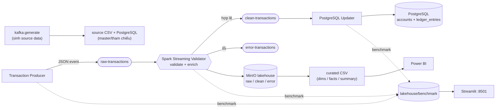
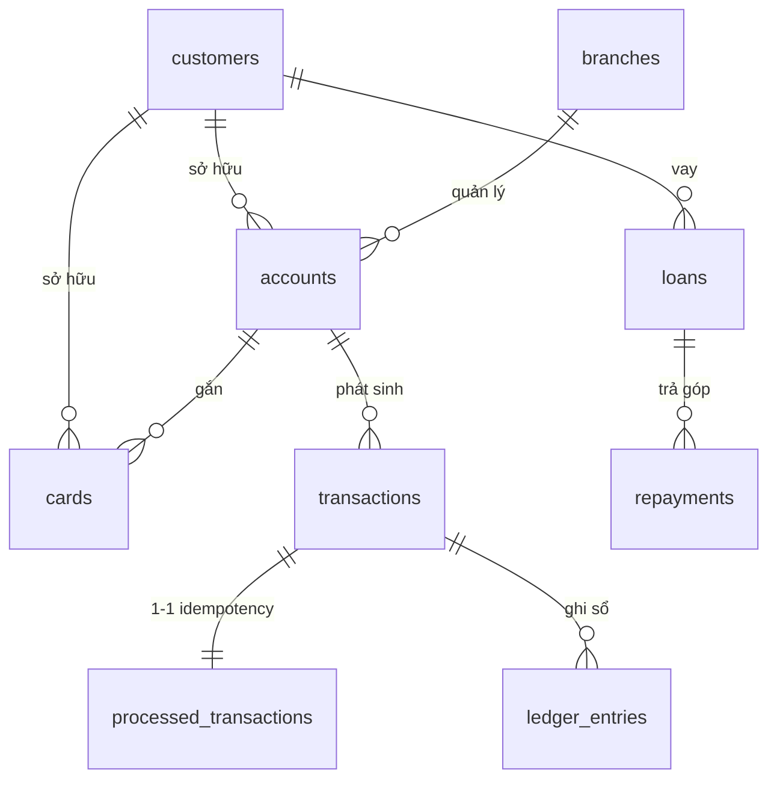

# Reliable Banking Data Lakehouse Pipeline

Demo pipeline **lakehouse ngân hàng theo hướng streaming-first**: Kafka nhận event giao dịch
thô, Spark Structured Streaming validate/enrich, event hợp lệ được ghi nhận vào PostgreSQL với
bảo đảm **ACID**, đồng thời sinh các CSV curated cho Power BI và một dashboard **Streamlit** để
xem benchmark Kafka / Spark / Database. Một luồng **batch** được giữ lại để kiểm thử local và
backfill.

> Toàn bộ tài liệu, comment code và file `.md` viết bằng tiếng Việt theo quy ước của repo.

## Mục lục

- [1. Kiến trúc & sơ đồ pipeline](#1-kiến-trúc--sơ-đồ-pipeline)
- [2. Luồng nghiệp vụ](#2-luồng-nghiệp-vụ)
- [3. Cơ sở dữ liệu (PostgreSQL)](#3-cơ-sở-dữ-liệu-postgresql)
- [4. Dữ liệu lakehouse & dashboard](#4-dữ-liệu-lakehouse--dashboard)
- [5. Ghi nhận giao dịch ACID](#5-ghi-nhận-giao-dịch-acid-trên-postgresql)
- [6. Hướng dẫn sử dụng](#6-hướng-dẫn-sử-dụng)
- [7. Giao diện & UI](#7-giao-diện--ui)
- [8. Hiệu năng & tối ưu](#8-hiệu-năng--tối-ưu)
- [9. Quan sát: log + Streamlit benchmark](#9-quan-sát-log--streamlit-benchmark)
- [10. Cấu trúc source code](#10-cấu-trúc-source-code)
- [11. Ghi chú Windows / Git Bash](#11-ghi-chú-windows--git-bash)
- [12. Khắc phục sự cố](#12-khắc-phục-sự-cố)

---

## 1. Kiến trúc & sơ đồ pipeline

Nguyên tắc thiết kế cốt lõi: **Spark sở hữu chất lượng dữ liệu, updater sở hữu trạng thái tài
chính.** Hai phần tách rời chủ động và chỉ giao tiếp qua Kafka topic.



### Kafka topics

| Topic | Producer | Consumer | Mục đích | Retention |
| --- | --- | --- | --- | --- |
| `raw-transactions` | transaction producer | Spark validator | Event giao dịch thô | 7 ngày |
| `clean-transactions` | Spark validator | PostgreSQL updater | Event hợp lệ, sẵn sàng ghi nhận | 7 ngày |
| `error-transactions` | Spark validator | lakehouse / dashboard | Lỗi chất lượng dữ liệu / nghiệp vụ | 30 ngày |

Mỗi topic có 3 partition (replication factor = 1 vì cụm demo chỉ 1 broker).

---

## 2. Luồng nghiệp vụ

1. **Sinh dữ liệu nguồn** — `kafka.generate` tạo customers/accounts/cards/loans/repayments/
   merchants/branches (source CSV) và lịch sử giao dịch; dữ liệu master được nạp vào PostgreSQL.
2. **Phát sinh giao dịch** — `Transaction Producer` bắn event giao dịch JSON vào `raw-transactions`,
   kèm `producer_ts_ms` để đo end-to-end latency.
3. **Validate & enrich** — `Spark Streaming Validator` kiểm tra schema, ràng buộc tham chiếu
   (account/customer tồn tại), rule nghiệp vụ (số tiền > 0, thời gian không ở tương lai, channel/
   status hợp lệ), **khử trùng** theo `transaction_id`, rồi sinh các trường dẫn xuất. Event hợp lệ
   → `clean-transactions`; event lỗi → `error-transactions`; cả hai cùng được ghi CSV vào lakehouse.
4. **Ghi nhận tài chính (ACID)** — `PostgreSQL Updater` consume `clean-transactions`, cập nhật số
   dư `accounts` trong **một DB transaction** với idempotency + row lock + sổ cái bất biến
   (xem [mục 5](#5-ghi-nhận-giao-dịch-acid-trên-postgresql)).
5. **Curated & báo cáo** — từ dữ liệu clean dựng các bảng dimension/fact/summary cho Power BI và
   sinh `docs/data_quality_report.md`.
6. **Benchmark** — producer/Spark/updater ghi số liệu throughput–latency ra `lakehouse/benchmark/`;
   dashboard **Streamlit** đọc và hiển thị realtime (làm mới bằng nút trên giao diện).

---

## 3. Cơ sở dữ liệu (PostgreSQL)

Schema ở `configs/resources/postgres/schema.sql`. Quan hệ dưới đây là **logic** (được đảm bảo bởi
khâu validate), schema không đặt ràng buộc khóa ngoại cứng để giữ pipeline linh hoạt khi backfill.



### Nhóm A — Master / tham chiếu

**`customers`** — hồ sơ khách hàng

| Trường | Kiểu | Mô tả |
| --- | --- | --- |
| `customer_id` | TEXT **PK** | Mã khách hàng |
| `full_name` | TEXT | Họ tên |
| `gender` | TEXT | `MALE` / `FEMALE` / `OTHER` |
| `dob`, `age` | DATE, INT | Ngày sinh, tuổi |
| `province`, `district` | TEXT | Địa bàn |
| `occupation` | TEXT | Nghề nghiệp |
| `monthly_income_vnd` | NUMERIC | Thu nhập/tháng (VND) |
| `customer_segment` | TEXT | `MASS` / `MASS_AFFLUENT` / `HNW` |
| `phone_hash`, `email_hash`, `cccd_hash` | TEXT | PII đã hash SHA-256 |
| `created_at`, `updated_at` | TIMESTAMP | Mốc tạo/cập nhật |

**`accounts`** — tài khoản (số dư cập nhật bởi updater)

| Trường | Kiểu | Mô tả |
| --- | --- | --- |
| `account_id` | TEXT **PK** | Mã tài khoản |
| `customer_id` | TEXT → customers | Chủ tài khoản |
| `account_type` | TEXT | `CASA` / `SAVING` / `CREDIT` |
| `open_date` | DATE | Ngày mở |
| `balance_vnd` | NUMERIC | **Số dư** — cập nhật có row-lock |
| `status` | TEXT | `ACTIVE` / `CLOSED` / `SUSPENDED` |
| `branch_id` | TEXT → branches | Chi nhánh quản lý |
| `created_at`, `updated_at` | TIMESTAMP | Mốc tạo/cập nhật |

**`cards`** — thẻ

| Trường | Kiểu | Mô tả |
| --- | --- | --- |
| `card_id` | TEXT **PK** | Mã thẻ |
| `customer_id`, `account_id` | TEXT → customers/accounts | Chủ thẻ / tài khoản gắn |
| `card_type` | TEXT | `ATM` / `DEBIT` / `CREDIT` |
| `card_number_masked` | TEXT | Số thẻ đã che |
| `issued_date`, `expiry_date` | DATE | Phát hành / hết hạn |
| `status` | TEXT | `ACTIVE` / `BLOCKED` / `EXPIRED` |

**`branches`** — chi nhánh

| Trường | Kiểu | Mô tả |
| --- | --- | --- |
| `branch_id` | TEXT **PK** | Mã chi nhánh |
| `branch_name` | TEXT | Tên |
| `province`, `district` | TEXT | Địa bàn |
| `branch_type` | TEXT | `BRANCH` / `TRANSACTION_OFFICE` |

**`merchants`** — đơn vị chấp nhận thanh toán

| Trường | Kiểu | Mô tả |
| --- | --- | --- |
| `merchant_id` | TEXT **PK** | Mã merchant |
| `merchant_name` | TEXT | Tên |
| `merchant_category` | TEXT | Ngành hàng |
| `province` | TEXT | Địa bàn |
| `risk_level` | TEXT | `LOW` / `MEDIUM` / `HIGH` |

**`loans`** — khoản vay · **`repayments`** — lịch sử trả nợ (cho Project credit risk)

| `loans` | Kiểu | | `repayments` | Kiểu |
| --- | --- | --- | --- | --- |
| `loan_id` **PK** | TEXT | | `repayment_id` **PK** | TEXT |
| `customer_id` | TEXT | | `loan_id`, `customer_id` | TEXT |
| `loan_type` | TEXT | | `due_date`, `paid_date` | DATE |
| `loan_amount_vnd` | NUMERIC | | `due_amount_vnd`, `paid_amount_vnd` | NUMERIC |
| `interest_rate_pct` | NUMERIC | | `days_past_due` | INT |
| `term_months` | INT | | `repayment_status` | `ON_TIME`/`LATE`/`MISSED` |
| `start_date`, `end_date` | DATE | | | |
| `loan_status` | `ACTIVE`/`CLOSED`/`DEFAULT` | | | |

### Nhóm B — Giao dịch & sổ cái (do updater ghi)

**`transactions`** — giao dịch đã ghi nhận (POSTED)

| Trường | Kiểu | Mô tả |
| --- | --- | --- |
| `transaction_id` | TEXT **PK** | Mã giao dịch |
| `account_id`, `customer_id` | TEXT | Tài khoản / khách hàng |
| `amount_vnd` | NUMERIC | Số tiền (VND nguyên) |
| `transaction_type` | TEXT | `DEPOSIT` ghi có, còn lại ghi nợ |
| `transaction_time` | TIMESTAMP | Thời điểm giao dịch |
| `status` | TEXT | Trạng thái |
| `created_at` | TIMESTAMP | Mốc ghi nhận |

**`processed_transactions`** — sổ điều phối idempotency

| Trường | Kiểu | Mô tả |
| --- | --- | --- |
| `transaction_id` | TEXT **PK** | Khóa unique chống xử lý trùng |
| `kafka_topic`, `kafka_partition`, `kafka_offset` | TEXT/INT/BIGINT | Lineage offset Kafka |
| `status` | TEXT NOT NULL | `PROCESSING` / `POSTED` / `REJECTED` |
| `error_message` | TEXT | Lý do reject (`ACCOUNT_NOT_FOUND`, `INSUFFICIENT_FUNDS`) |
| `processed_at`, `posted_at` | TIMESTAMP | Mốc nhận / ghi xong |

**`ledger_entries`** — sổ cái bất biến (audit)

| Trường | Kiểu | Mô tả |
| --- | --- | --- |
| `ledger_id` | BIGSERIAL **PK** | Số dòng sổ cái |
| `transaction_id`, `account_id` | TEXT NOT NULL | Tham chiếu giao dịch/tài khoản |
| `debit_vnd`, `credit_vnd` | NUMERIC | Ghi nợ / ghi có |
| `balance_after_vnd` | NUMERIC NOT NULL | Số dư sau bút toán |
| `entry_type` | TEXT NOT NULL | Loại bút toán |
| `created_at` | TIMESTAMP | Mốc ghi sổ |

---

## 4. Dữ liệu lakehouse & dashboard

Bucket MinIO `banking-lakehouse`. **Chỉ event giao dịch** chảy qua lakehouse; master/tham chiếu nằm
ở PostgreSQL/source CSV và **không** mirror lên MinIO.

```text
banking-lakehouse/lakehouse/
  raw/        raw_transactions.csv          (event trước validate)
  clean/      clean_transactions.csv        (event hợp lệ + trường dẫn xuất)
  error/      error_transactions.csv        (event lỗi + metadata lỗi)
  curated/    dim_*.csv, fact_*.csv, daily_transaction_summary.csv, customer_summary.csv
  audit/      (Spark checkpoint)
  benchmark/  kafka_producer.csv, spark_validator.csv, db_updater.csv   (Streamlit đọc)
```

### Trường dẫn xuất của giao dịch clean

`transaction_date`, `transaction_hour` (tách từ `transaction_time`) · `delay_hours` (độ trễ
ingestion) · `is_late_arriving` (1 nếu `delay_hours > 24`) · `is_outlier` (1 nếu `amount_vnd ≥
500.000.000`) · `is_night_transaction` (1 nếu giờ < 6h hoặc ≥ 22h) · `data_quality_status`
(`VALID` / `VALID_WITH_FLAGS`) · `processed_at` · `batch_id`.

### Bản ghi error

`error_id`, `source_table`, `raw_payload`, `error_type`, `error_message`, `failed_column`,
`rule_name`, `batch_id`, `source_system`, `ingestion_time`.

### Đầu ra dashboard (`dashboard/`)

| File | Nội dung |
| --- | --- |
| `quality_summary.csv` | Số record valid theo customers/accounts/transactions + tổng invalid |
| `quality_errors.csv` | Thống kê lỗi theo source_table, error_type, cột, rule |
| `storage_benchmark.csv` | Dung lượng (byte) theo layer raw/clean/curated/error |
| `query_benchmark.csv` | Thời gian quét `daily_transaction_summary` |
| `file_inventory.csv` | Danh sách file + row count mỗi lần chạy |
| `daily_transaction_summary.csv` | Copy từ curated cho Power BI đọc trực tiếp |

Mỗi lần chạy, `export_metrics` còn sinh `docs/data_quality_report.md` (markdown tự sinh).

---

## 5. Ghi nhận giao dịch ACID trên PostgreSQL

`postgres_transaction_updater` consume `clean-transactions` và ghi nhận mỗi giao dịch với:

- **Idempotency** — `processed_transactions.transaction_id` là khóa unique; event trùng bị bỏ qua.
- **Row lock** — `SELECT ... FOR UPDATE` trên `accounts` trước khi đổi số dư.
- **Ledger bất biến** — mỗi giao dịch sinh một dòng `ledger_entries` để audit.
- **Đúng thứ tự** — Kafka offset chỉ commit **sau khi** DB transaction thành công (at-least-once),
  kết hợp idempotency nên an toàn khi reprocess.

Giao dịch không hợp lệ về nghiệp vụ (`ACCOUNT_NOT_FOUND`, `INSUFFICIENT_FUNDS`) được **đánh dấu
REJECTED**, không âm thầm bỏ. Quy ước số tiền là VND nguyên; `transaction_type == "DEPOSIT"` ghi
có (credit), còn lại ghi nợ (debit).

---

## 6. Hướng dẫn sử dụng

### Yêu cầu

- Docker Desktop + Docker Compose.
- (Tùy chọn) Power BI Desktop để mở các CSV trong `dashboard/`.

Toàn bộ thao tác đi qua **2 script**: `scripts/setup.sh` (dựng hạ tầng) và
`scripts/start.sh [batch|streaming|pipeline]` (chạy pipeline).

### Bước 1 — dựng hạ tầng

```bash
sh scripts/setup.sh
```

Bật Kafka, Spark, PostgreSQL, MinIO, pgAdmin, **Streamlit**… và tạo 3 Kafka topic với
retention tương ứng.

### Bước 2 — chạy pipeline

```bash
# Demo streaming đầy đủ (khuyến nghị):
sh scripts/start.sh streaming

# Luồng batch dự phòng:
sh scripts/start.sh            # tương đương: sh scripts/start.sh batch

# Quy mô lớn hơn:
CUSTOMERS=10000 TRANSACTIONS=1000000 sh scripts/start.sh
```

> **Lưu ý:** `start.sh` build image với `--build` ở mỗi lần chạy, nên sửa code Python xong
> chỉ cần chạy lại script là image tự cập nhật (`docker compose up`/`run` **không** tự rebuild).

| Mode | Tác dụng |
| --- | --- |
| `batch` (mặc định) | Chạy container `pipeline` (toàn bộ ETL) rồi mirror `lakehouse/` lên MinIO |
| `streaming` | `setup.sh` → `pipeline` → nạp PostgreSQL → bật Spark validator + updater → bắn producer **liên tục ở chế độ nền** → mirror MinIO. Producer chạy mãi để Kafka luôn có message mới và Streamlit cập nhật benchmark theo thời gian thực |
| `pipeline` | Chỉ chạy chuỗi stage ETL trong container hiện tại (không gọi `docker compose`) — đây là `CMD` của `Dockerfile`, không tự gọi tay |

#### Hai cách quan sát producer ở mode `streaming`

Producer được điều khiển qua 2 biến môi trường (`docker-compose.yml` → service `transaction-producer`):

| Biến | Mặc định | Ý nghĩa |
| --- | --- | --- |
| `STREAM_TRANSACTIONS` | `0` | Số event cần bắn; **`<= 0` = bắn liên tục** tới khi dừng tay |
| `STREAM_INTERVAL_SECONDS` | `0.2` | Khoảng nghỉ giữa 2 event (giây); `0.2s` ⇒ ~5 msg/s |

```bash
# (A) Demo dòng chảy liên tục — pipeline luôn có dữ liệu mới (mặc định khi chạy streaming):
sh scripts/start.sh streaming
#   throughput ~5 msg/s = TỐC ĐỘ ĐẦU VÀO bị giới hạn (không phải năng lực tối đa).
#   Mục đích: xem pipeline có theo kịp input + đo latency end-to-end ở tải thấp.

# (B) Đo throughput ĐỈNH (số liệu mục §8) — bắn dồn 30k event tức thời:
docker compose stop transaction-producer
STREAM_TRANSACTIONS=30000 STREAM_INTERVAL_SECONDS=0 docker compose up -d --build transaction-producer

# Dừng producer:
docker compose stop transaction-producer
```

> Throughput trên Streamlit ở chế độ (A) chỉ phản ánh ~5 msg/s do `interval` tự đặt — **không**
> dùng để so với bảng §8. Muốn kiểm chứng bảng §8 phải chạy chế độ burst (B).

### Chạy trực tiếp từng stage (PYTHONPATH=src)

```bash
PYTHONPATH=src python -m kafka.generate --customers 1000 --transactions 10000
PYTHONPATH=src python -m application.load_sources_to_lakehouse
PYTHONPATH=src python -m application.prepare_clean_data
PYTHONPATH=src python -m application.build_curated_tables
PYTHONPATH=src python -m application.build_customer_features
PYTHONPATH=src python -m dashboard.export_metrics
```

Các service streaming là CLI module, hỗ trợ `--mode`/`--source`/`--sink` để cùng một code chạy
được cả batch lẫn streaming:

```bash
PYTHONPATH=src python -m kafka.producer --sink kafka --topic raw-transactions --count 1000 --interval-seconds 0
PYTHONPATH=src python -m spark.streaming_validator --mode streaming --bootstrap-servers kafka:9092
PYTHONPATH=src python -m application.postgres_transaction_updater --source kafka --topic clean-transactions
```

---

## 7. Giao diện & UI

| Công cụ | URL | Login | Xem gì |
| --- | --- | --- | --- |
| **Streamlit (benchmark)** | `http://localhost:8501` | — | Throughput/latency Kafka·Spark·DB, dung lượng, chất lượng dữ liệu |
| Kafka UI | `http://localhost:8083` | — | Topic, partition, message, consumer lag |
| Spark UI | `http://localhost:8082` | — | Job/stage, streaming query, executor |
| MinIO Console | `http://localhost:9001` | `minioadmin` / `minioadmin` | Bucket `banking-lakehouse` |
| pgAdmin | `http://localhost:5050` | `admin@bank.com` / `admin` | Bảng PostgreSQL, query |
| PostgreSQL | `localhost:5432` | `banking` / `banking` (db `banking`) | Kết nối trực tiếp |
| Power BI input | folder `dashboard/` | — | CSV cho Power BI Desktop |

### Streamlit benchmark (`:8501`)

Dashboard 5 tab — **Tổng quan / Kafka / Spark / Database / Lưu trữ & Chất lượng** — đọc số liệu
runtime từ `lakehouse/benchmark/*.csv` (do producer/Spark/updater ghi) và `dashboard/*.csv`. Sau
khi chạy `sh scripts/start.sh streaming`, bấm **🔄 Làm mới** để cập nhật. Nếu chưa có dữ liệu, mỗi
tab hiển thị hướng dẫn chạy lệnh tương ứng.

Hai chế độ producer (mục 6) cho hai góc nhìn khác nhau trên dashboard:
- **Liên tục (mặc định, ~5 msg/s)** — quan sát pipeline có theo kịp input + latency ở tải thấp;
  con số throughput = tốc độ đầu vào tự đặt, **không** phải năng lực tối đa.
- **Burst (`STREAM_INTERVAL_SECONDS=0`, ~30k event)** — đo throughput đỉnh, khớp bảng §8; lúc này
  e2e latency tăng vài chục giây do backpressure (chờ hàng đợi), không phải độ trễ xử lý.

---

## 8. Hiệu năng & tối ưu

> Đây là project cá nhân chạy trên **một máy** (Docker Desktop/WSL2): 1 Spark worker (1 core/1GB),
> 1 Kafka broker, 1 PostgreSQL node. Các tối ưu dưới đây nhắm vào quy mô đó.

### Tối ưu đã áp dụng

- **Producer** — tạo Producer một lần, gom message theo lô (`linger.ms`, `batch.size` lớn, nén
  `lz4`), `acks=all` + idempotence; chỉ flush ở cuối thay vì flush từng message.
- **Spark validator (cache)** — nạp reference (account/customer hợp lệ) **một lần lúc khởi động**
  thay vì đọc lại CSV ở mỗi micro-batch; hạ `spark.sql.shuffle.partitions=8` cho cụm 1 core.
- **PostgreSQL updater (đòn bẩy lớn nhất)** — chuyển từ "1 message = 1 DB transaction = 1 fsync"
  sang **xử lý theo micro-batch: gộp `--batch-size` (mặc định 500) bản ghi vào MỘT transaction,
  chỉ 1 fsync cho cả lô**. Mỗi bản ghi vẫn nằm trong savepoint riêng nên idempotency + row lock +
  ledger giữ nguyên; trong cùng transaction số dư cộng dồn đúng (Postgres đọc được write của chính
  nó). Offset Kafka cũng commit theo lô.
- **Chống deadlock khi chạy nhiều consumer** — mỗi lô được **sắp theo `account_id`** (sort ổn
  định) để mọi consumer khóa account theo CÙNG thứ tự ⇒ không tạo deadlock cycle; kèm **retry lô**.

### Số liệu đo (chế độ burst — gửi 20.000–30.000 event tức thời)

> Bảng này đo **throughput đỉnh** ở chế độ burst (mục 6 — cách B: `STREAM_INTERVAL_SECONDS=0`),
> **không** phải chế độ liên tục mặc định (~5 msg/s). Cách tái lập đúng số dưới đây: chạy cách B
> với 30k event rồi đọc đỉnh ở `lakehouse/benchmark/*.csv`.

| Thành phần | Trước tối ưu | Sau tối ưu | Mục tiêu "Tốt" (cụm lớn) |
| --- | --- | --- | --- |
| Producer (1 luồng Python) | ~4.700 msg/s | **~38.000–49.000 msg/s** | 50k–200k |
| Spark validator | ~330–1.130 events/s | **~2.500–3.400 events/s** | 50k–300k |
| Updater **1 instance** | ~400 txn/s | **~1.000–1.069 txn/s** (≈2,5x) | 40k–180k |
| Updater 3 instances | ~735 txn/s | ~1.100 txn/s (≈ 1 instance) | — |

**Tính đúng đắn (ACID)** sau mọi lần chạy: `transactions = ledger_entries = POSTED`; rejection được
đánh dấu; idempotency chống trùng.

### Phát hiện then chốt

Sau khi batch hóa, **PostgreSQL 1 node trở thành trần throughput (~1.000 txn/s)**: chạy 3 consumer
song song chỉ cho ~1.100 txn/s tổng (≈ bằng 1 instance) do cùng đập vào một DB (tranh chấp row-lock
+ fsync tuần tự). ⇒ **Với máy đơn, 1 updater batched là cấu hình tối ưu** — cũng là default của
`scripts/start.sh streaming`.

Latency end-to-end khi đo lớn (vài chục giây) chủ yếu là **thời gian chờ hàng đợi** (backpressure)
do bắn hàng chục nghìn event tức thời trong khi pipeline rút ~1.000/s, không phải độ trễ xử lý
thuần. Sàn latency thực tế ≈ thời lượng một micro-batch Spark (vài giây trên 1 core).

### Hướng nâng cấp (nếu mở rộng hạ tầng)

- DB: ghi lô bằng `COPY` vào staging rồi MERGE, connection pool, **sharding/partition `accounts`
  theo account_id**.
- Spark: tăng core/executor, dynamic allocation, **bỏ ghi CSV khỏi hot path** (chỉ Kafka/Parquet).
- Kafka: cụm ≥ 3 broker để dùng replication factor = 3.

---

## 9. Quan sát: log + Streamlit benchmark

Các service in log `key=value` (qua stdlib `logging`), xem trực tiếp bằng `docker logs`:

```bash
docker logs <producer-container> | grep -E "producer_progress|producer_done"
docker logs spark-streaming-validator | grep spark_microbatch
docker logs <updater-container>      | grep updater_throughput
```

Cùng các mốc đó, mỗi service còn ghi một dòng benchmark vào `lakehouse/benchmark/<thành-phần>.csv`
(best-effort, lỗi I/O không làm sập job) để **Streamlit `:8501`** vẽ biểu đồ throughput/latency.

---

## 10. Cấu trúc source code

Import chỉ chảy một chiều xuống: `application → base → connector → transform → utils`. I/O nằm
trong `connector/`, logic thuần trong `transform/`, config typed trong `utils/model/`, magic
string gom vào `utils/string_constants.py` (alias `SC`).

- `src/config/settings.py` — nguồn chân lý duy nhất cho mọi path, default volume, danh sách bảng,
  Kafka servers/topics. Override qua env (`DATA_DIR`, `LAKEHOUSE_DIR`, `DASHBOARD_DIR`, `DOCS_DIR`,
  `BENCHMARK_DIR`).
- `src/base/base_job.py` — `BaseJob` Template Method (`run()` = setup → execute → teardown, bắt lỗi
  phân loại); các service chạy dài kế thừa lớp này.
- `src/kafka/` — `generate.py` (simulator sinh source data), `producer.py`
  (`TransactionProducerJob`, đẩy event giao dịch ra stdout/Kafka/CSV).
- `src/transform/` — logic thuần dễ unit-test: `validators.py`, `error_handler.py`, `inject.py`
  (chèn lỗi để kiểm thử chất lượng dữ liệu). Không có I/O.
- `src/spark/streaming_validator.py` — `StreamingValidatorJob` + `run_batch()` dự phòng.
- `src/application/` — các stage batch (load → clean → curated → customer features) và
  `postgres_transaction_updater.py` (`KafkaUpdaterJob`).
- `src/connector/` — adapter ra hệ ngoài: `postgres_connector.py`, `minio_connector.py`,
  `kafka_connector.py`, `lakehouse_sink.py` (ghi CSV raw/clean/error), `benchmark_sink.py`
  (`record_benchmark` → CSV benchmark cho Streamlit).
- `src/dashboard/` — `export_metrics.py` (sinh CSV Power BI + báo cáo chất lượng) và
  `benchmark_app.py` (dashboard **Streamlit** xem benchmark Kafka/Spark/DB).
- `src/utils/` — `io.py`; `logging.py` (`setup_logging` + logger `key=value`); `exception_handler.py`
  (`handle_fatal_error`); `optional_dependency.py` (`load_optional`); `string_constants.py`
  (`StringConstants`/`SC`); `model/` (DTO `PostgresConfig`, `MinioConfig`, `KafkaConfig` + `from_dict`).
- `configs/resources/postgres/` — `schema.sql`, `load_sources.sql`.
- `Dockerfile` — image runtime nhẹ (Python 3.10) cho pipeline/producer/updater.
  `Dockerfile.streamlit` — image riêng (streamlit + pandas) cho dashboard benchmark.

### Quy ước

- Dependency nặng (`pyspark`, `confluent_kafka`, `psycopg`) import lười qua
  `utils.optional_dependency.load_optional` nên module vẫn import được khi thiếu thư viện và chỉ
  raise `RuntimeError` khi thực sự dùng tới.
- Magic string (config key Kafka/Spark, status lifecycle) gom vào `utils/string_constants.py`;
  config đọc qua DTO typed `utils/model/*` thay vì dict thô.
- Container `pipeline` dọn `data/`, `lakehouse/` và dashboard CSV mỗi lần chạy trừ khi đặt
  `CLEAN_OUTPUT=0`.

---

## 11. Ghi chú Windows / Git Bash

- Các script `*.sh` được ép **LF** (xem `.gitattributes`) để chạy đúng trong container Linux.
- Trên **Git Bash**, các lệnh `docker exec ... /opt`, `/sql` cần `MSYS_NO_PATHCONV=1` để đường dẫn
  không bị đổi sang `C:\...`; `setup.sh` và phần Docker của `start.sh` đã tự đặt. Trên Linux/WSL
  biến này vô hại.

---

## 12. Khắc phục sự cố

| Triệu chứng | Nguyên nhân | Cách xử lý |
| --- | --- | --- |
| `scripts/...: set: Illegal option -` | Script bị line-ending CRLF | Đã ép LF qua `.gitattributes`; nếu tái diễn, convert lại sang LF |
| Spark validator báo lỗi Kafka connector | Sai version package | Dùng `org.apache.spark:spark-sql-kafka-0-10_2.13:4.1.2` (khớp Spark 4.1.2/Scala 2.13) |
| `FileNotFoundException /nonexistent/.ivy2...` | Spark image không có HOME để ghi cache Ivy | Đã set `--conf spark.jars.ivy=/tmp/.ivy2` + `HOME=/tmp` |
| `mkdir of .../audit/... failed` | User spark không ghi được volume | Validator chạy `user: root` |
| Streamlit `:8501` trống/“Chưa có dữ liệu” | Chưa chạy pipeline nên thiếu CSV benchmark | Chạy `sh scripts/start.sh streaming` rồi bấm 🔄 Làm mới |
| Sửa code nhưng không thấy thay đổi (vd producer gửi 0 message) | `docker compose up`/`run` chạy **image cũ** (không tự rebuild) | Chạy lại `sh scripts/start.sh ...` (đã kèm `--build`) hoặc `docker compose build <service>` |
| Throughput trên Streamlit chỉ ~5 msg/s | Đang ở chế độ producer **liên tục** (`interval 0.2s`) — đây là tốc độ đầu vào, không phải năng lực | Bình thường. Muốn đo đỉnh: chạy chế độ burst (mục 6 — cách B) |
| Kafka UI không thêm message mới | Producer đã dừng/chưa chạy/đang dùng image cũ | Kiểm tra `docker compose ps`; chạy lại streaming (kèm `--build`) |
